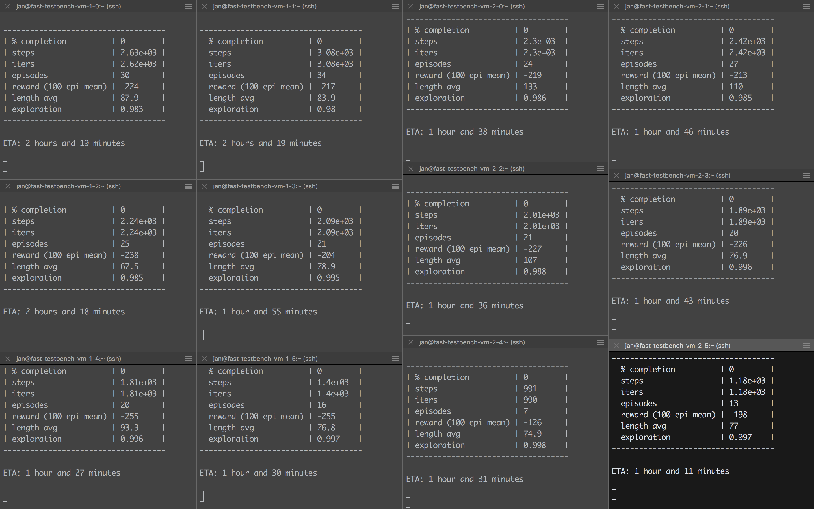
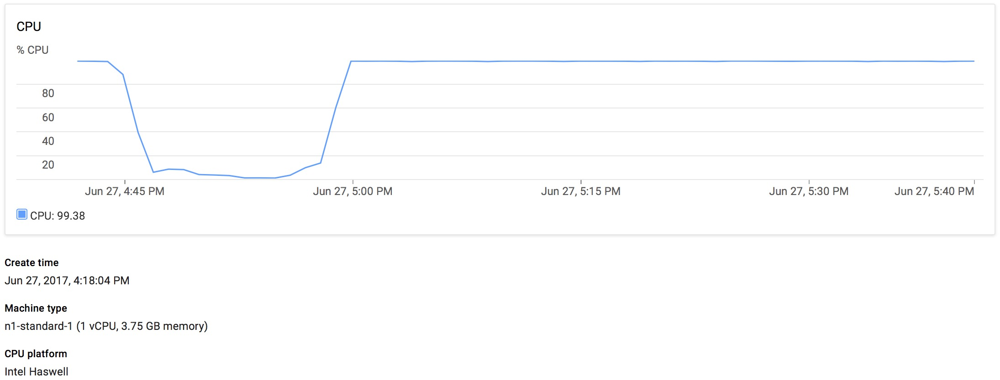
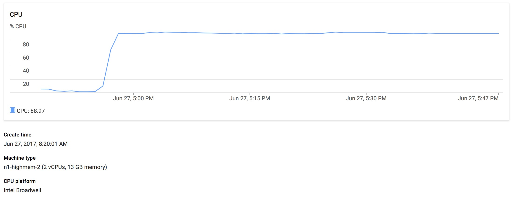
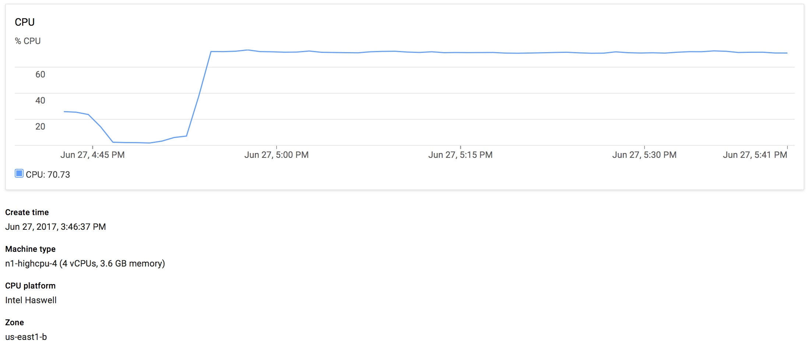
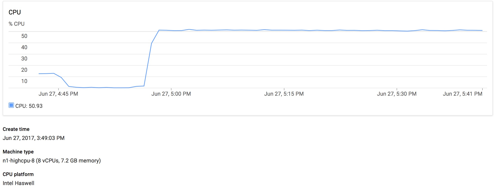
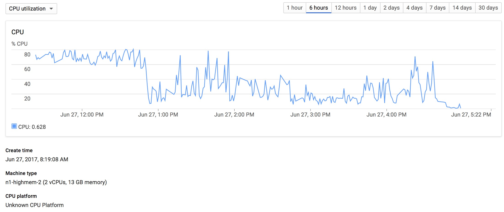
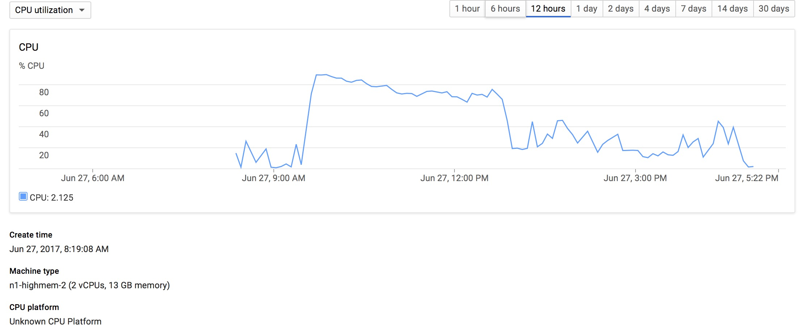

# Deep Reinforcment Learning Project 2017
[Deep RL Project Calendar](https://calendar.google.com/calendar/ical/fuc8n5c750pte22c32kgi940ug%40group.calendar.google.com/private-42a8e26f0d1130a135a2a1fd08accb6a/basic.ics)
<!-- markdown-toc start - Don't edit this section. Run M-x markdown-toc-generate-toc again -->
**Table of Contents**

- [Deep Reinforcment Learning Project 2017](#deep-reinforcment-learning-project-2017)
    - [Setup](#setup)
        - [Docker](#docker)
            - [Install docker (from [the docker docs](https://docs.docker.com/engine/installation/linux/ubuntu/#install-docker())):](#install-docker-from-the-docker-docshttpsdocsdockercomengineinstallationlinuxubuntuinstall-docker)
            - [Build docker image and run the container](#build-docker-image-and-run-the-container)
                - [(Recommended) Use docker container as a service.](#recommended-use-docker-container-as-a-service)
                - [Interact with the container](#interact-with-the-container)
    - [SWIG\_Constant\_randInt Fix](#swigconstantrandint-fix)
    - [How to run experiments](#how-to-run-experiments)
        - [Configs](#configs)
            - [Example `configs.py`](#example-configspy)
            - [How to write a config](#how-to-write-a-config)
            - [Keys](#keys)
        - [Running an experiment (only use if you do not use the docker container as a service)](#running-an-experiment-only-use-if-you-do-not-use-the-docker-container-as-a-service)
    - [Google Cloud Platform Deployment](#google-cloud-platform-deployment)
        - [Get the `gcloud` command line tools (ubuntu)](#get-the-gcloud-command-line-tools-ubuntu)
        - [Build and push your docker image](#build-and-push-your-docker-image)
        - [Create a GCE VM instance](#create-a-gce-vm-instance)
        - [Configure and run our docker image](#configure-and-run-our-docker-image)
        - [Download results from VM](#download-results-from-vm)
        - [Google Cloud Platform](#google-cloud-platform)
            - [vCores and Tensorflow sessions](#vcores-and-tensorflow-sessions)
                - [Number of Cores](#number-of-cores)
                    - [One core and one core used by TF session](#one-core-and-one-core-used-by-tf-session)
                    - [Two core and two core used by TF session](#two-core-and-two-core-used-by-tf-session)
                    - [Four core and four core used by TF session](#four-core-and-four-core-used-by-tf-session)
                    - [Eight core and Eight core used by TF session](#eight-core-and-eight-core-used-by-tf-session)
            - [Cores allocated by Tensorflow](#cores-allocated-by-tensorflow)
        - [Continous Integration](#continous-integration)
        - [Create GPU ready instance](#create-gpu-ready-instance)
    - [Project Plan](#project-plan)
    - [Paper Guidelines](#paper-guidelines)
    - [Misc. Notes](#misc-notes)
        - [OpenAI gym installation](#openai-gym-installation)

<!-- markdown-toc end -->

## Setup
**Optional**: This project has been packaged as a python pip package (but was not published to PyPI). This makes it possible to run setup.py and use our main facilities (train.py, dual_monitor.py, utils.py, etc.) in other projects.

### Docker
#### Install docker (from [the docker docs](https://docs.docker.com/engine/installation/linux/ubuntu/#install-docker())):
1. 
```bash
$ sudo apt-get install \
    apt-transport-https \
    ca-certificates \
    curl \
    software-properties-common
```

2. 
```bash
$ curl -fsSL https://download.docker.com/linux/ubuntu/gpg | sudo apt-key add -
```

3. Verify that the key fingerprint is `9DC8 5822 9FC7 DD38 854A E2D8 8D81 803C 0EBF CD88`.
```
sudo apt-key fingerprint 0EBFCD88

pub   4096R/0EBFCD88 2017-02-22
      Key fingerprint = 9DC8 5822 9FC7 DD38 854A  E2D8 8D81 803C 0EBF CD88
uid                  Docker Release (CE deb) <docker@docker.com>
sub   4096R/F273FCD8 2017-02-22
```

4. 
```bash
$ sudo add-apt-repository \
   "deb [arch=amd64] https://download.docker.com/linux/ubuntu \
   $(lsb_release -cs) \
   stable"
```

5. 
```bash
$ sudo apt-get update
$ sudo apt-get install docker-ce
```

6. Verify everything works correctly
```bash
$ sudo docker run hello-world
```

#### Build docker image and run the container
1. Navigate to the root directory of your clone of this repo. Then run:
```bash
$ cd docker
$ docker build -t laermannjan/nip-deeprl-docker:cpu .
```

2.Substitute `$REPO_ROOT` by the root directory to you clone of the repo. 
##### (Recommended) Use docker container as a service.
```bash
$ docker run --rm -itv $REPO_ROOT/data:/mnt/data laermannjan/nip-deeprl-docker:cpu --config config_name1
```
You can pass the same argumemts you would pass onto testbench.py to the docker container, like we did with `--config config_name1` in the example above. **Important:** make sure you do not change the mount point `/code` and that your repo is named `nip-deeprl-project`.
##### Interact with the container
```bash
$ docker run --rm -itv $REPO_ROOT/data:/mnt/data laermannjan/nip-deeprl-docker:cpu /bin/bash
```
This will run the image in a new container and open up an interactive bash entrypoint for you.
You will be able to access the code of this repo from inside that container at `/code/nip-deeprl-project`.
Inside you need to switch to custom conda environment:
```bash
$ source activate py35
```
Your command line should now look something like this: `(py35) root@382c92f920a0:~#`.

3. (Not yet implemented) You can also run a jupyter notebook instance as an entrypoint via: 
```bash
docker run --rm -itv  $REPO_ROOT/data:/mnt/data -p 8888:8888 laermannjan/nip-deeprl-docker:cpu
```
## SWIG\_Constant\_randInt Fix
From [Issue #17](https://github.com/laermannjan/nip-deeprl-project/issues/17)
Box2D needs swig3.0 to properly compile.
Ubuntu 14.10 and above should behave correctly. 14.04 Trusty Tahr does not have swig3.0 in default repositories, therefore we need to make backport repos available 
According to [Greg Brockman](https://github.com/openai/gym/issues/83#issuecomment-218357232) (these commands remove any installed older versions of Swig):

```bash
$ echo deb http://archive.ubuntu.com/ubuntu trusty-backports main restricted universe multiverse | sudo tee /etc/apt/sources.list.d/box2d-py-swig.list
$ apt-get update && install -t trusty-backports swig3.0
$ apt-get remove swig swig2.0
$ ln -s /usr/bin/swig3.0 /usr/bin/swig
```

Additionally we can install a prebuilt binary of Box2D to eliminate another source of compile complications:
```bash
# Create conda env with python version 3.3, 3.4 or 3.5
$ conda create -n py35 python=3.5
$ source activate py35
# Install binaries
$ conda install -c https://conda.anaconda.org/kne pybox2d
```

## How to run experiments
The main logic is implemented inside the python package.
A complimentary test script `testbench.py` has been included outside of the package.
Additionally a complimentary `configs.py` has been included where you can define the setup for your experiments.

### Configs
You can pass a set of parameters for your experiment via the `--config CONFIG [CONFIG ...]` argument of `testbench.py`.
In this case `CONFIG` must be the name of a config defined in `conigs.py`, i.e. it must match a `key` in the `Configs` dict inside `configs.py`.

#### Example `configs.py`
(This is still an [open issue](https://github.com/laermannjan/nip-deeprl-project/issues/13))
```python
Configs = {
    'config_name1': {
        'key1': 'value1',
        'key2': value2
        ...
    },
    'config_name2': {
        'key1': 'value4',
        'key3': value3
        ...
    },
    ....
}
```

To match our guidelines on how to conduct experiments, `config.py`\'s `Configs` must contain three configs, namely `AB_basic`, `CP_basic` and `LL_basic`. These should define the baseline setting for each game respectively.

#### How to write a config
A config **must** define the `'env'` key and its value **must** be either `Acrobot-v1`, `Cartpole-v0` or `LunarLander-v1`.
Other than that you only need (and should) define the parameters you want changed with respect to the baseline config, e.g.:

```python
Configs = {
    'AB_basic': {
        'env': 'Acrobot-v1',
        'gamma': 0.99,
        'arch': [30,30,30]
    },
    'AB_test_gamma': {
        'env': 'Acrobot-v1'
        'gamma': 0.7
    }
        
}
```

#### Keys
All available keys have been defined in `testbench.py` as arguments of the command line, e.g.
```python
parser.add_argument("--env", type=str, choices=[spec.id for spec in envs.registry.all()], default="LunarLander-v2", help="name of the game")
```
An `argument` in `testbench.py` of type `"--argument-name"` gets translated into a `key` in `configs.py` of type `'argument_name'`, note the switch from hyphen to underscore.

### Running an experiment (only use if you do not use the docker container as a service)
A simple run can now be initiated by `python testbench.py --config AB_test_gamma`.
Checkout `testbench.py` for all possible arguments to pass, but note that if an argument is defined in the specified config it will take priority!
Command-line arguments can still be of use if you quickly want to change something for test purposes (but you should not use them for proper experiment evaluation).
Some noteworthy arguments are:
- `--repeat COUNT` - let\'s you specify how often an specific experiment should be repeated to minimise statistical errors.
- `--capture-videos` - as name suggests turns on video rendering, this will slow down the experiment.
- `--write-upon-reset` - write intermediary experiment results to fail after each episode. This makes everything more failsave but might slow down the experiment significantly depending on the data-storage connection.
- `--save-dir` - root of where you want your experiments outputs saved. If you pass a relative path, note that this is relative to from where you called the script, not where the script is located! *Note* per default this outputs to the `data` directory inside your clone of the repo. This makes it easy for you to share (i.e. push your result to github). **IMPORTANT** If you are inside docker, make sure that you either run the script from where it is located (i.e. `cd` to `/code/nip-deeprl-project` and run `python testbench.py ...` there) or specify `-save-dir` to be 
`/code/nip-deeprl-project/data`.

## Google Cloud Platform Deployment
This is a step-by-step guide of what I did in order to get deploy and run our docker container on google compute engine.

First you need to sign-up for their service. You will get $300 of free computing time with a max period of 12 months. It will ask for credit card details, but as long as you do not upgrade to a paid plan, you won't be charged.

Before we start you need to [create a project](https://console.cloud.google.com/cloud-resource-manager)

### Get the `gcloud` command line tools (ubuntu)
(Taken from their docs)
```bash
# Create an environment variable for the correct distribution
export CLOUD_SDK_REPO="cloud-sdk-$(lsb_release -c -s)"

# Add the Cloud SDK distribution URI as a package source
echo "deb http://packages.cloud.google.com/apt $CLOUD_SDK_REPO main" | sudo tee -a /etc/apt/sources.list.d/google-cloud-sdk.list

# Import the Google Cloud Platform public key
curl https://packages.cloud.google.com/apt/doc/apt-key.gpg | sudo apt-key add -

# Update the package list and install the Cloud SDK
sudo apt-get update && sudo apt-get install google-cloud-sdk

## Initilize your account settings
gcloud init

To continue, you must log in. Would you like to log in (Y/n)? Y

# Next select the project you've created beforehand.
Pick cloud project to use:
 [1] [my-project-1]
 [2] [my-project-2]
 ...
 Please enter your numeric choice:
 
# You probably want to choose europe-west1-b (there's info on why too choose which online)
 Which compute zone would you like to use as project default?
 [1] [asia-east1-a]
 [2] [asia-east1-b]
 ...
 [14] Do not use default zone
 Please enter your numeric choice:
 
 
 gcloud has now been configured!
 You can use [gcloud config] to change more gcloud settings.

 Your active configuration is: [default]
```

### Build and push your docker image
1. Enable billing in your project settings (this should be on by default if this was your first project)
2. [Enable the API](https://console.cloud.google.com/flows/enableapi?apiid=containerregistry.googleapis.com&redirect=https:%2F%2Fcloud.google.com%2Fcontainer-registry%2Fdocs%2Fquickstart)
3. Build the image
```bash
cd $REPO_ROOT
docker build -t IMAGE_NAME .
```
4. Tag the image
```
docker tag IMAGE_NAME HOST_ID/PROJECT_ID/IMAGE_NAME
```
HOST\_ID should probably be `eu.gcr.io` if you're in europe.  
PROJECT\_ID is the name you gave your project earlier.  
IMAGE_NAME is a name of your choosing.

5. push the image
```bash
gcloud docker -- push HOST_ID/PROJECT_ID/IMAGE_NAME
```

### Create a GCE VM instance
We're gonna create an instance with 4 vCPUs and ~15GBs RAM.

1. Google provides VM OSes which are optimized for running docker containers inside, you can get a list of current images like this:
```bash
gcloud compute images list \
  --project cos-cloud \
  --no-standard-images
  
NAME                     PROJECT    FAMILY      DEPRECATED  STATUS
cos-beta-60-9592-23-0    cos-cloud  cos-beta                READY
cos-dev-61-9655-0-0      cos-cloud  cos-dev                 READY
cos-stable-57-9202-74-0  cos-cloud                          READY
cos-stable-58-9334-74-0  cos-cloud  cos-stable              READY
cos-stable-59-9460-64-0  cos-cloud  cos-stable              READY
```
We're selecting the latest stable one: `cos-stable-59-9460-64-0`.

2. Create a single VM instance
```bash
gcloud compute instances create VM_NAME \
    --image IMAGE_NAME \
    --image-project cos-cloud \
    --zone ZONE \
    --machine-type TYPE_ID
```
We use  `cos-stable-59-9460-64-0` as `IMAGE_NAME` and `n1-standard-4` as `TYPE_ID`.
`VM_NAME` is of your choosing.

I created 12 VMs, 6 each in two zones `europe-west1-b` and `europe-west2-a` as trial users have a restriction of 24 cores per region (`europe-west1` defines the region, `-b` the zone) and named them `testbench-vm-1-0` until `testbench-vm-2-5`.

3. Connect to your vm
```bash
gcloud compute ssh VM_NAME \
    --project PROJECT_NAME \
    --zone ZONE
```
This might ask you to generate a private/public key pair and enter a password, or if you've already done that just might ask for just that password.

### Configure and run our docker image
Inside the VM you can now pull and run our docker image.
As you pushed your image to `gcr.io` which is a private repo, you need to setup some environment variables.
Fortunately, Google provides a script at `/usr/share/google/dockercfg_update.sh`.
```bash
/usr/share/google/dockercfg_update.sh && docker pull HOST_ID/PROJECT_ID/IMAGE_NAME
```

Finally, you're able to run your experiments.
```bash
mkdir -p ~/data && docker run --rm -v ~/data:/mnt/data HOST_ID/PROJECT_ID/IMAGE_NAME --config CONFIG --repeat COUNT
```
This will create a data directory in the VM\'s home directory and save the outputs of your experiment to it.
Your final setup could then look something like this   

### Download results from VM
For later saving the results(-folder) to your computer:
```bash
gcloud beta compute scp INSTANCE_NAME:~/data PATH_TO_LOCAL_DIR --recurse
```  
This will download all results to in 'data' in your LOCAL_DIR

### Google Cloud Platform
#### vCores and Tensorflow sessions
The number of vCores and the number of cores used by the TensorFlow session (set in `train.py`) seem to have a very huge impact on the overall performance of the system.
In the following test `Google Compute Engine VMs` have been used and setup up in an attempt to always utilize the newest Core chipsets (Skylake or Broadwell) available.
The provisioned vCores run, depending on the chipset, at around 2.0GHz - 2.6GHz. Memory size and speed was not investigated, however the smallest setup (1 vCore) does only come with 3.5GB of RAM, which we consider minimum (note that GCE VMs offer a setup `n1-highcpu-2` which only comes with 1.8GB RAM)
##### Number of Cores
Four configurations where tested: 1, 2, 4, and 8 cores.
Each ran a docker container containing an image with our project in it, which utilized exactly the number of cores for its TensorFlow session has its host offered (1, 2, 4, and 8, respectively). The container was handed off to the docker daemon and the output directed to a file `experiment.log` to not slow down the process by outputting onto the console. The testbench configuration used is `AB_e10_short_de` (no reason to choose one in particular).
Following are the results in terms of CPU usage and estimated times of the experiment to finish (as predicted by the script itself).
###### One core and one core used by TF session

> ETA after 100 episodes: 9h34min

###### Two core and two core used by TF session

> ETA after 100 episodes: 11h03min

> As this result was very unexpected I repeated it on a new VM with very similar results (ETA: 11h14min).

###### Four core and four core used by TF session

> ETA after 100 episodes: 6h15min

###### Eight core and Eight core used by TF session

> ETA after 100 episodes: 4h19min

#### Cores allocated by Tensorflow
In an attempt to increase CPU usage when more than one core is present, an experiment has been conducted with two virtual cores on the host, while tensorflow attempts to allocate four.

> Very shaky behaviour with a clear declining trend


> It seems at first when the experiment started (shortly after 9AM), everything went well...until it didn't.

### Continous Integration
We push our docker image builds to (a subdomain of) `gcr.io`.
While we usually do this via 
```bash
$ docker build -t IMG_NAME REPO_DIR
$ docker tag NAME HOST_ID/PROJECT_NAME/IMG_NAME:TAG
$ gcloud docker -- push HOST_ID/PROJECT_NAME/IMG_NAME:TAG
```
We can automate the process conveniently like in GCE:  
0. (Prerequisites) You must have created a GCP account and started a new project (as described above) and initiated billing for it (top left of the page go &#9776; --> Billing).
> Also create a file called `set-env.sh` in the `nip-deeprl-project/gce/` directory like so
    
```bash
#!/usr/bin/env bash

export PROJECT_NAME='your_project_name_in_single_quotes_here'
```

 
1. &#9776; --> Container Registry --> Build Triggers --> Click Add Trigger
2. Select github and grant GCP permission to hook into your Github account as an application. 
3. Choose `nip-deeprl-project` from the list of your repos and tick that you give your consent at the bottom.
Google will now mirror our repo to their servers (you can find it under &#9776; --> Source Repository) ... this may take a little while.
4. Leave everything as is on the final page, except the `Image Name`.
Change it so it like so `eu.gcr.io/PROJECT_NAME/IMAGE_NAME:$COMMIT_SHA`

> Add this to youre `set-env.sh`

```bash
export GCR_IMAGE=eu.gcr.io/PROJECT_NAME/IMAGE_NAME:$COMMIT_SHA`
```

where `PROJECT_NAME` is the name you gave your project in GCP earlier
and `IMAGE_NAME` is how you want your image to be named (this is the same thing you set with `docker tag IMAGE_NAME ...`)

5. Go to &#9776; --> Compute Engine --> VM Instances --> Create Instance
On the bottom of the page click `command-line` (it reads `Equivalent in REST or command-line`) and locate the `--service-account` argument. Copy the email-like string after it including the double quotes and put it at the bottom of your `set-env.sh`
```bash
export GOOGLE_SERVICE_ACCOUNT=the_thing_you_just_copied
```

6. Now also add the direction to you clone of our repo, so that your entire `set-env.sh` looks like so

```bash
#!/usr/bin/env bash

export PROJECT_NAME='your_project_name_in_single_quotes_here'
export GCR_IMAGE=eu.gcr.io/PROJECT_NAME/IMAGE_NAME:$COMMIT_SHA`
export GOOGLE_SERVICE_ACCOUNT=the_thing_you_just_copied
export REPO_ROOT=/path/to/nip-deeprl-project
```

7. Copy `nip-deeprl-project/gce/distribute-tasks.sh` and name the copy `distribute-tasks-your_name.sh` (that way they won't conflict in git)
In this file you will find an array `exps`.
Arrays in bash-script are defined like `arr=( "element1" "element2" ... "elementn")`. Make sure you respect the whitespaces.
Each group of 8 entries in `exps` will be assigned to VMs within the same cluster.
So the first 8 will be pushed to `europe-west1-d` and the next 8 to `europe-west2-a`.
Make sure that if you repeat a config name in `exps` you put all of them within the same group of 8!
`exps` **must** consist of 64 valid configs name or you will pay for idling VMs.
8. Run the scripts
```bash
cd path/to/nip-deeprl-project/gce
bash set-env.sh
bash google-compute-engine-init.sh 
bash distribute-tasks-your_name.sh
```
> Be aware, because the scripts are designed to spawn parallel requests to Google's server you might see pretty strange suff on the console. Just wait for 30s after each of the last two scripts, press ENTER and see if nothing furher happens, then continue with the next one.

### Create GPU ready instance
Go to `Networking -> Firewall Rules` and create 2 new rules:
1. jupyter, ip range `0.0.0.0/0`, tag `jupyter`, and ports `tcp:8888`
2. tensorboard, ip range `0.0.0.0/0`, tag `tensorboard`, and ports `tcp:6006`

Create a new VM with minimal settings and select to have `1` GPU.
Add the networking tags from above: `jupyter` and `tensorboard`.

In the VM install CUDA and set environment variables : `bash scripts/install-cuda.sh`

Verify your installation with 
```bash
$ nvidia-smi

###### expected output ###### 
+-----------------------------------------------------------------------------+
| NVIDIA-SMI 375.66                 Driver Version: 375.66                    |
|-------------------------------|----------------------|----------------------+
| GPU  Name        Persistence-M| Bus-Id        Disp.A | Volatile Uncorr. ECC |
| Fan  Temp  Perf  Pwr:Usage/Cap|         Memory-Usage | GPU-Util  Compute M. |
|===============================+======================+======================|
|   0  Tesla K80           Off  | 0000:00:04.0     Off |                    0 |
| N/A   35C    P8    27W / 149W |     15MiB / 11439MiB |      0%      Default |
+-------------------------------|----------------------|----------------------+

+-----------------------------------------------------------------------------+
| Processes:                                                       GPU Memory |
|  GPU       PID  Type  Process name                               Usage      |
|=============================================================================|
|    0      2175    G   /usr/lib/xorg/Xorg                              15MiB |
+-----------------------------------------------------------------------------+
```

To install cudNN you need to register as an NVIDIA developer and download cudNN (v5.1 or above) from [here](https://developer.nvidia.com/cudnn ).
Upload it to your VM via `gcloud compute scp /path/to/your/downloaded/cudnn.tar.gz VM-INSTANCE-NAME:~ --zone ZONE-OF-THIS-INSTANCE`
And install it via 
```bash
$ cd
$ tar xzvf cudnn-8.0-linux-x64-v5.1.tgz
$ sudo cp cuda/lib64/* /usr/local/cuda/lib64/
$ sudo cp cuda/include/cudnn.h /usr/local/cuda/include/
$ rm -rf ~/cuda
$ rm cudnn-8.0-linux-x64-v5.1.tgz
```

Install the correct docker with `bash scripts/install-docker-ce.sh`.

And install the nvidia-docker plugin: 
```bash
wget https://github.com/NVIDIA/nvidia-docker/releases/download/v1.0.1/nvidia-docker_1.0.1-1_amd64.deb
sudo dpkg -i nvidia-docker*.deb
sudo nvidia-docker-plugin &
```

(This sometimes throws an error, like 'port already in use' or similar. Ignore and continue with following check)

Check that you can access GPU inside container:
```bash
sudo nvidia-docker run --rm nvidia/cuda nvidia-smi

###### expected output ###### 
+-----------------------------------------------------------------------------+
| NVIDIA-SMI 375.66                 Driver Version: 375.66                    |
|-------------------------------|----------------------|----------------------+
| GPU  Name        Persistence-M| Bus-Id        Disp.A | Volatile Uncorr. ECC |
| Fan  Temp  Perf  Pwr:Usage/Cap|         Memory-Usage | GPU-Util  Compute M. |
|===============================+======================+======================|
|   0  Tesla K80           Off  | 0000:00:04.0     Off |                    0 |
| N/A   35C    P8    27W / 149W |     15MiB / 11439MiB |      0%      Default |
+-------------------------------|----------------------|----------------------+

+-----------------------------------------------------------------------------+
| Processes:                                                       GPU Memory |
|  GPU       PID  Type  Process name                               Usage      |
|=============================================================================|
|    0      2175    G   /usr/lib/xorg/Xorg                              15MiB |
+-----------------------------------------------------------------------------+
```

If everything worked out, go to GCE -> Snapshots and create a snapshot from this instance with its designated source disk!

## Experience replay buffer
We use the prioritizes replay buffer from the baseline implementation, which takes the parameter:
```python
    def __init__(self, size, alpha):
        """Create Prioritized Replay buffer.
        Parameters
        ----------
        size: int
            Max number of transitions to store in the buffer. When the buffer
            overflows the old memories are dropped.
        alpha: float
            how much prioritization is used
            (0 - no prioritization, 1 - full prioritization)

```
Note that the standard replay buffer corresponds to the prioritized replay buffer with alpha = 0.
In addition to the basic case we examine alpha \in {0.2 , 0.8}

When we take a minibatch we sample according to:
```python
    def sample(self, batch_size, beta):
        """Sample a batch of experiences.
        compared to ReplayBuffer.sample
        it also returns importance weights and idxes
        of sampled experiences.
        Parameters
        ----------
        batch_size: int
            How many transitions to sample.
        beta: float
            To what degree to use importance weights
            (0 - no corrections, 1 - full correction)

```
For our experiments we fix beta = 0.5 .

The baseline (prioritized) replay buffer is filled according to the FIFO method, e.g. when the buffer overflows the old memories are dropped. 
The paper "Off-policy experience retention for deep actor-critic learning" proposes to separate the replay buffer D. 
This is motivated by the fact that due to the decreasing exploration rate the samples in the replay buffer might not cover the full domain of the function we are learning. So information over a previosly learned function over certain parts of our domain might get lost. 
They propose to split in replay buffer D into two equally sized parts A and B. Part A is a standard FIFO replay buffer. 

They define for each sample the off policy score:
OFFPOL score(i) = (|| |a_i - pi(s_i|policy)||_2)^2. 
If B is full and t new samples occur the t samples with the lowest OFFPOL score are overwritten such that we keep the experience in the buffer that differ the most from out current policy.
In this setting we introduce a further parameter omega and sample with probability omega from A and with prob. (1-omega) from B.
To pick a specific sample from A or B we could use the baseline sample function. 

We could examine if the periodic occurence of dips in the reward of the LL_basic changes with the change in the (prioritized) replay buffer.
## Imagespace and conv2d layer  
Adding convolutional layer via TF (from https://www.tensorflow.org/tutorials/layers) 
(the dense layer is our first fully connected layer, everything else (except imagesize) can stay the same):
```python
# Input Layer
  input_layer = tf.reshape(features, [-1, 28, 28, 1])

  # Convolutional Layer #1
  conv1 = tf.layers.conv2d(
      inputs=input_layer,
      filters=32,
      kernel_size=[5, 5],
      padding="same",
      activation=tf.nn.relu)

  # Pooling Layer #1
  pool1 = tf.layers.max_pooling2d(inputs=conv1, pool_size=[2, 2], strides=2)

  # Convolutional Layer #2 and Pooling Layer #2
  conv2 = tf.layers.conv2d(
      inputs=pool1,
      filters=64,
      kernel_size=[5, 5],
      padding="same",
      activation=tf.nn.relu)
  pool2 = tf.layers.max_pooling2d(inputs=conv2, pool_size=[2, 2], strides=2)

  # Dense Layer
  pool2_flat = tf.reshape(pool2, [-1, 7 * 7 * 64])
  dense = tf.layers.dense(inputs=pool2_flat, units=1024, activation=tf.nn.relu)
  
```  

or create a CNN directly with cnn_to_mlp from baselines.deepq.models (https://github.com/openai/baselines/blob/master/baselines/deepq/models.py ):
```python
def cnn_to_mlp(convs, hiddens, dueling=False):

    """This model takes as input an observation and returns values of all actions.
    Parameters
    ----------
    convs: [(int, int int)]

        list of convolutional layers in form of

        (num_outputs, kernel_size, stride)

    hiddens: [int]

        list of sizes of hidden layers

    dueling: bool

        if true double the output MLP to compute a baseline

        for action scores

    Returns

    -------

    q_func: function

        q_function for DQN algorithm.

    """
    return lambda *args, **kwargs: _cnn_to_mlp(convs, hiddens, dueling, *args, **kwargs)
```

Rendering environment as image (env is the specified environment):
```python
env.render(return_rgb_array = mode=='rgb_array')
```
-> mode is defined in ENV mode = ['human','rgb_array']
-> Return an numpy.ndarray with shape (x, y, 3),
   representing RGB values for an x-by-y pixel image, suitable
   for turning into a video.
Converting RGB to grayscale (from https://www.tensorflow.org/api_docs/python/tf/image/rgb_to_grayscale):
```python
import tf.image.rgb_to_grayscale

rgb_to_grayscale(
    images,
    name=None
)
```

## Project Plan

- timeline
    - [x] run vanilla DQN (statespace)
	- [x] find stable parameters (Cartpole,Acrobot,Lunarlander)
    - [x] move from vanilla DQN to baseline implementation 
    	- [X] find stable parameters in statespace (Acrobot,Lunarlander)
	- [x] adapt to imagespace 
	- [ ] find stable parameters in imagespace (Acrobot,Lunarlander)

- Notes
    - Change architecture
	- [x] rectifier units instead of hyperbolic tangent (!!! Xavier initialization is for sigmoidal units, LeCun init for ReLU
	- [x] discount factor gamma
        WENDELIN's comment: 
		>too large = unstable, too small = doesn't transport reward far enough
		>there is some meassure of how robust the network is, by changing gamma and calculate number of steps needed (didn't understand that too well)
				
- Ideas: (if time)
    	- [ ] Prioritized replay (hint to goal heuristic), like sample 10%:
	    ( close to goal, rest-> uniform))
		( sample more where large TD-error and maybe add annealing sampling from there)
	  	( sample often near the goal in beginning and anneal to uniform or large TD-error )				
	- [ ] replace ringbuffer via uniform sampling instead of start->end->start..

## Paper Guidelines
Wendilin is ok to only receive a single paper, needs to have independently written parts with clear assignment.

Wendilin's writing sequence:
* preliminary
* method
* experiment
* introduction (including results)
				
## Misc. Notes
### OpenAI gym installation
IF pachi-py fails to build wheel:
use `MACOSX_DEPLOYMENT_TARGET=10.12 pip install -e .[all]` (for bash/zsh)
or `env MACOSX_DEPLOYMENT_TARGET=10.12 pip install -e .[all] (for fish)`
... installer seems to assume OSX 10.5 as build env by default.
